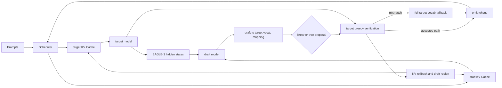

<p align="center">
  
</p>

# nano-vLLM EAGLE-3

这是一个用于学习和验证投机解码的个人项目，基于
[GeeeekExplorer/nano-vllm](https://github.com/GeeeekExplorer/nano-vllm)
开发。仓库保留了上游简洁的推理框架，我新增的部分集中在 EAGLE-3：
draft/target 双模型执行、两套 KV Cache、EAGLE hidden states、跨 tokenizer
词表映射、线性和多分支 tree proposal、target verification、回滚和指标采集。

项目当前仍没有取得正吞吐加速，但已经修复了 EAGLE-3 token/hidden shift、
draft KV 位置和 target auxiliary hidden-state 对齐问题。固定负载下，优化后的
linear packed 路径吞吐为普通自回归的 `0.80x`，TPOT 从 `10.38 ms` 降到
`8.13 ms`。这里保留负结果，因为完整 target 词表验证和可复现数据比一个好看的
加速数字更重要。

## English summary

This fork adds a correctness-first EAGLE-3 speculative decoding path to
nano-vLLM, including dual model execution, separate KV caches, EAGLE hidden
states, tokenizer vocabulary mapping, linear and tree proposals, target
verification, rollback, and reproducible metrics. On the documented RTX 5060 Ti
workload, the optimized linear packed path reaches 0.80x of autoregressive
throughput while reducing per-request TPOT. The remaining negative result and
its bottlenecks are reported as measured.

## 实现范围

- `SamplingParams(temperature=0)` 使用 argmax。EAGLE-3 当前只支持 greedy，
  正温度请求会明确报错，因为 rejection sampling 尚未实现。
- draft token 可以通过词表映射转换到 target token。target fallback 始终在
  151,936 个 target vocabulary logits 上选择，不会被 32K draft 子词表限制。
- EAGLE-3 prefill 按训练口径组合 `target hidden(token i)` 与
  `embedding(token i+1)`；draft KV position 相对 target 序列左移一位。
- Qwen3 auxiliary hidden states 在目标层输入处采集，层号为 `2 / 14 / 25`，
  与 vLLM 的 Qwen3 EAGLE-3 接口一致。
- tree verifier 先用 target 验证 root，再沿匹配分支继续。root 不匹配时立即输出
  target fallback。
- `spec_verifier_mode="packed"` 用一次 target prefill 验证整条 linear path，
  并用 CUDA Graph 覆盖 target、LM head、argmax 和 draft step；这是性能默认值。
- `spec_verifier_mode="sequential"` 保留逐 token target 验证，用于与 baseline
  做严格正确性回归。packed 与动态尾批可能因 BF16 GEMM shape 不同而改变近似
  argmax，因此性能输出摘要不作为严格正确性依据。
- Scheduler 为 proposal 预留 KV block，验证后回滚未接受位置。tree 路径会把实际
  接受序列 replay 到 draft KV Cache。
- 请求结束后释放 target/draft block，并清理 `seq_prev_hidden`。
- `LLM.generate(..., return_metrics=True)` 返回每个请求的 TTFT、TPOT 和端到端延迟。
  `LLM.get_spec_stats(reset=False)` 返回 proposal、接受 token 和分阶段计时。

## 架构



数据流中只有 proposal token 使用 draft 到 target 的词表映射。验证和 fallback
都读取完整 target logits。两套 KV Cache 共享 Scheduler 的逻辑 block 生命周期，
但存储彼此独立。

## 安装

推荐使用本仓库的 conda 环境，并隔离用户级 Python 包：

```bash
conda activate nano-vllm
export PYTHONNOUSERSITE=1
pip install -e ".[dev]"
```

模型目录默认如下，也可以通过 benchmark 参数或环境变量覆盖：

```text
./huggingface/Qwen3-1.7B
./huggingface/AngelSlim/Qwen3-1.7B_eagle3
```

greedy EAGLE-3 示例：

```python
from nanovllm import LLM, SamplingParams

llm = LLM(
    "./huggingface/Qwen3-1.7B",
    draft_model="./huggingface/AngelSlim/Qwen3-1.7B_eagle3",
    num_spec_tokens=3,
    spec_verifier_mode="packed",
    max_model_len=2048,
)
outputs = llm.generate(
    ["Explain speculative decoding in one paragraph."],
    SamplingParams(temperature=0, max_tokens=128, ignore_eos=True),
    return_metrics=True,
)
print(outputs[0])
print(llm.get_spec_stats())
llm.exit()
```

## 正确性测试

CPU 单元测试覆盖 greedy sampler、完整词表 fallback、tree topology、指标分母和
KV reserve/rollback：

```bash
conda activate nano-vllm
PYTHONNOUSERSITE=1 python -m pytest -q tests/test_core.py
```

GPU 测试使用 sequential verifier，对比 baseline、linear 和 tree 的 token IDs，
覆盖 batch 1、batch 16、256-token KV block 边界和连续三次状态清理：

```bash
conda activate nano-vllm
PYTHONNOUSERSITE=1 python tests/test_eagle3_correctness.py
```

## 一键 benchmark

正式命令会检查 GPU、模型路径和 conda 环境版本，然后分别调用 `nano-vllm` 与
`vllm` 环境。两端必须产生相同 workload digest，最后才会合并报告。

```bash
./scripts/benchmark_resume.sh
```

快速检查：

```bash
./scripts/benchmark_resume.sh --smoke
```

可以通过 `TARGET_MODEL`、`DRAFT_MODEL`、`NANO_VLLM_ENV`、`VLLM_ENV`、
`VLLM_SOURCE_REPO`、`VLLM_FLASH_ATTN_SOURCE` 和 `BENCHMARK_OUTPUT_DIR`
覆盖默认值。脚本会为固定的 vLLM tag 创建临时 git worktree，并复用该环境的
编译扩展及匹配版本的 flash-attention Python wrapper，不会切换或修改当前 vLLM
工作区。正式产物位于
[`benchmarks/results/rtx5060ti_qwen3_1_7b`](benchmarks/results/rtx5060ti_qwen3_1_7b)。

## 基准口径

正式负载固定为 RTX 5060 Ti 16GB、Qwen3-1.7B target、
AngelSlim/Qwen3-1.7B_eagle3 draft、TP=1、batch 16、输入和输出各 128 token、
greedy、`ignore_eos=True`、seed 42、K=3、`max_model_len=2048`。16 个自然语言
prompt 经同一 tokenizer 确定性补齐或截断，workload SHA256 为
`6cc3bda376604d06b504f2f16d1c1abe8bd36dc64d3518bf7b14391d5e1790e7`。

每个 case 加载一次模型，执行 1 次预热和 3 次正式测试：

- TTFT 和 TPOT 不包含模型加载及 tokenizer。
- throughput 等于实际 output tokens 除以批次墙钟时间。
- acceptance rate 等于 accepted draft tokens 除以 proposed path tokens。
- acceptance length 等于 emitted tokens 除以 sequence-level proposals。
- nano linear 性能使用 packed verifier；tree 当前仍使用 sequential verifier，
  因而是功能/瓶颈诊断项，不与 vLLM linear EAGLE 路径直接比较。
- nano 的峰值是 PyTorch allocator peak，包含权重、固定 64-block target/draft KV
  Cache、CUDA Graph 和推理临时张量。vLLM 使用 NVML device peak。两者统计口径
  不同，不能直接用来比较框架显存效率。

## 实测结果

测试日期为 2026-07-27。nano 环境使用 Python 3.12.12、PyTorch 2.7.0+cu128；
vLLM 对比环境为 v0.13.0、PyTorch 2.9.0+cu128。

| Case | output tok/s, mean ± std | TTFT ms, mean ± std | TPOT ms, mean ± std | acceptance rate | acceptance length | peak GiB |
|---|---:|---:|---:|---:|---:|---:|
| nano baseline | 1406.88 ± 0.95 | 137.68 ± 0.37 | 10.38 ± 0.01 | - | - | 5.10 |
| nano EAGLE-3 linear packed | 1124.60 ± 10.71 | 144.96 ± 0.09 | 8.13 ± 0.05 | 47.03% | 2.385 | 5.47 |
| nano EAGLE-3 tree sequential | 248.26 ± 0.27 | 144.99 ± 0.09 | 48.60 ± 0.05 | 49.63% | 2.460 | 5.47 |
| vLLM baseline | 1366.24 ± 1.94 | 138.94 ± 0.13 | 10.70 ± 0.02 | - | - | 12.15 |
| vLLM EAGLE-3 | 1291.15 ± 80.52 | 221.83 ± 101.27 | 7.72 ± 0.03 | 38.05% | 2.142 | 12.92 |

nano linear 为 baseline 的 `0.799x`，tree 为 `0.176x`。vLLM EAGLE-3 为其
baseline 的 `0.945x`。相较修复前的正式数据，nano linear acceptance rate 从
`1.66%` 提升到 `47.03%`，吞吐从 `287.59` 提升到 `1124.60 tok/s`。

严格 sequential gate 中，nano baseline、linear、tree 在 batch 1/16 和 KV block
边界逐 token 完全一致。性能 benchmark 的 packed/dynamic-tail 摘要与 baseline
不同，但各自三次运行内部稳定；vLLM v0.13.0 的 speculative 摘要同样与其
baseline 不同。这里把两者都视为 BF16 kernel/batch-shape 数值差异，不用性能
摘要代替严格正确性测试。

完整 JSON、逐次结果和合并报告见
[`report.md`](benchmarks/results/rtx5060ti_qwen3_1_7b/report.md)。

另做了一次 output=32 的分阶段诊断。优化后的 linear packed 路径每个 batch
step 的 draft、target verification、accept/cache 分别约为 2.37、21.06、
1.39 ms；verification 仍占三段总时间约 85%，是剩余主瓶颈。该诊断启用了 CUDA
同步计时，只用于归因，不参与正式吞吐均值。原始记录见
[`nano_linear_packed_phase.json`](benchmarks/results/diagnostics/nano_linear_packed_phase.json)。

## 已知限制

- EAGLE-3 只支持 greedy。正温度 rejection sampling 不在本轮范围内。
- linear packed 虽有 47.0% acceptance rate，但 target verification 和动态尾批
  仍使总吞吐低于 baseline；当前不能宣称正加速。
- packed verifier 与 baseline 可能因 BF16 batch shape 产生不同 greedy argmax；
  需要逐 token 一致性时使用 sequential verifier。
- tree proposal 仍包含 Python 控制流、逐层 attention metadata 和 cache replay。
- 本仓库的 `wpc` 分支包含 EAGLE-3 工作。`main` 另有独立 ngram 实现，两条分支
  没有做高风险合并。

旧的单次实验只用于追踪调试过程，不应与正式三次结果混用，见
[`benchmarks/legacy`](benchmarks/legacy) 和
[`vllm_test/legacy`](vllm_test/legacy)。

## 简历表述

> 在 nano-vLLM 中实现 EAGLE-3 双模型 KV Cache、跨 tokenizer vocabulary
> mapping 与 packed/tree proposal/target verification；构建固定 128/128、
> batch 16、3 次重复的正确性与性能基准，修复 token/hidden/KV 对齐后将 linear
> draft acceptance rate 从 1.66% 提升到 47.03%、mean acceptance length 提升到
> 2.38，TPOT 由自回归的 10.38 ms 降至 8.13 ms，吞吐达到 baseline 的 0.80x，
> 并定位 packed target forward 与动态尾批为剩余瓶颈。

项目仓库：[McSpicyWings/nano-vllm](https://github.com/McSpicyWings/nano-vllm)
